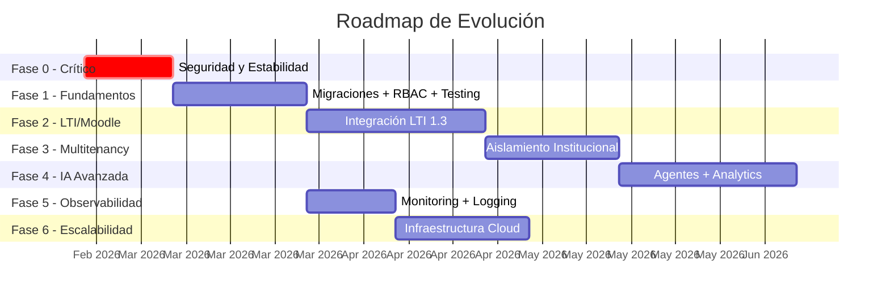
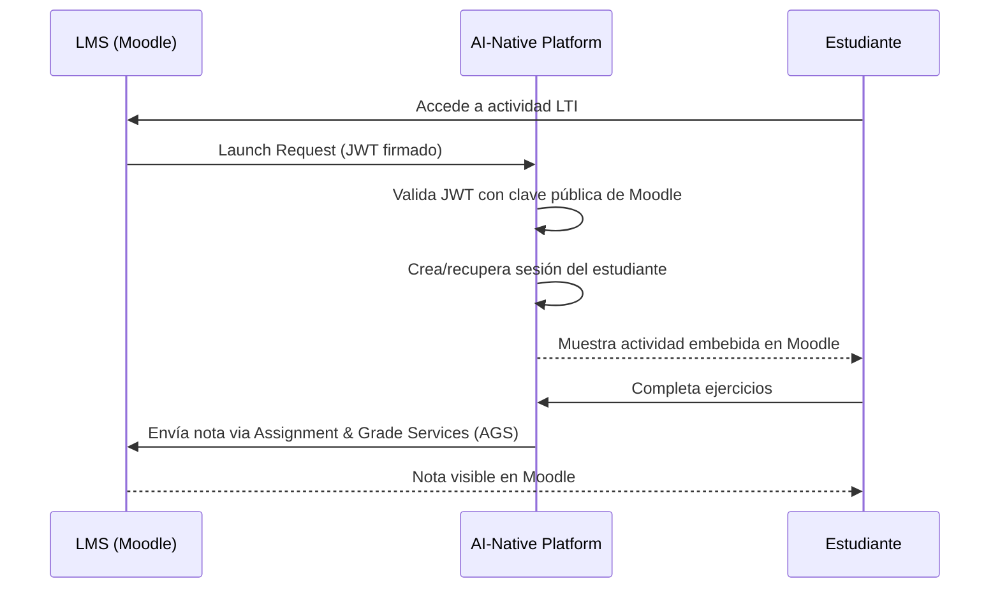
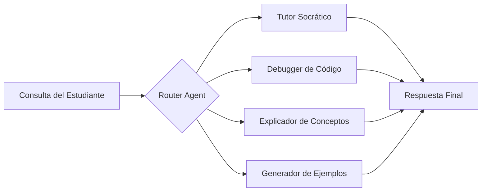
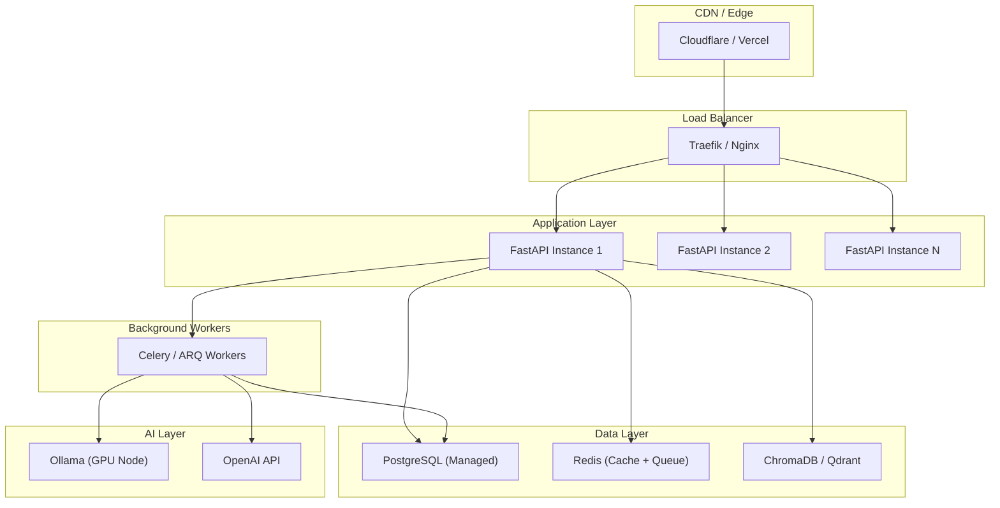
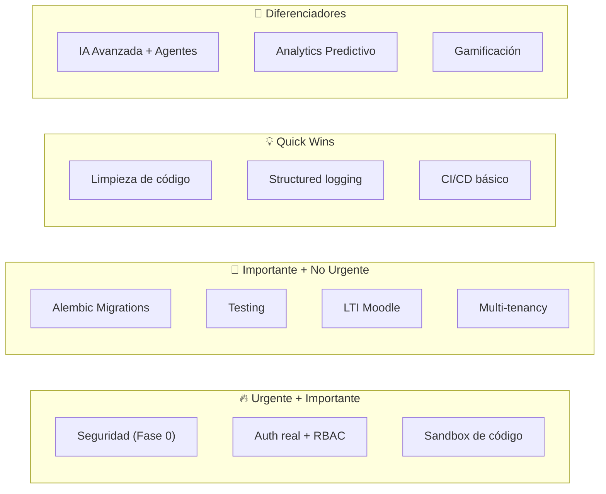

# 🚀 Roadmap: De MVP a Plataforma Educativa de Producción

**Proyecto**: Fase Final — AI-Native Learning Platform  
**Fecha**: 18 de febrero de 2026  
**Objetivo**: Transformar el MVP funcional en una plataforma educativa real, escalable, segura y lista para instituciones.

---

## Visión General



---

## Fase 0 — Remediación Crítica de Seguridad

> [!CAUTION]
> **Esta fase es bloqueante**. Nada debería desplegarse a producción sin completarla.

### 0.1 Eliminar SECRET_KEY Hardcodeada

#### [MODIFY] [settings.py](file:///c:/Users/juani/Desktop/Fase%20Final/src/infrastructure/config/settings.py)

```diff
- SECRET_KEY: str = "supersecretkey"  # TODO: Move to .env for production
+ SECRET_KEY: str  # REQUIRED — must be set via .env or env var
+ # Generate with: python -c "import secrets; print(secrets.token_urlsafe(64))"
```

Y agregar en `.env`:
```ini
SECRET_KEY=<generado-con-secrets.token_urlsafe(64)>
```

### 0.2 Implementar Autenticación Real en Todas las Rutas

Reemplazar el mock `student_id: str = "default_student"` por inyección desde JWT:

#### [NEW] `src/infrastructure/http/dependencies/auth.py`

```python
from fastapi import Depends, HTTPException, status
from fastapi.security import OAuth2PasswordBearer
from src.infrastructure.auth.jwt_token_provider import JwtTokenProvider

oauth2_scheme = OAuth2PasswordBearer(tokenUrl="/api/v1/auth/token")

def get_current_user_id(token: str = Depends(oauth2_scheme)) -> str:
    provider = JwtTokenProvider()
    try:
        payload = provider.verify_token(token)
        user_id = payload.get("sub")
        if not user_id:
            raise HTTPException(status_code=401, detail="Invalid token payload")
        return user_id
    except ValueError:
        raise HTTPException(status_code=401, detail="Invalid or expired token")

def require_role(required_role: str):
    def role_checker(token: str = Depends(oauth2_scheme)) -> str:
        provider = JwtTokenProvider()
        payload = provider.verify_token(token)
        roles = payload.get("roles", [])
        if required_role not in roles:
            raise HTTPException(status_code=403, detail="Insufficient permissions")
        return payload.get("sub")
    return role_checker
```

### 0.3 Sandboxear la Ejecución de Código

Reemplazar `subprocess.run` directo por ejecución en container Docker aislado:

#### [MODIFY] [local_code_executor.py](file:///c:/Users/juani/Desktop/Fase%20Final/src/infrastructure/grading/local_code_executor.py)

Cambiar a un `DockerCodeExecutor` que:
- Cree un container efímero (`python:3.11-alpine`) por ejecución
- Monte el código como volumen read-only
- Limite CPU (0.5 cores), memoria (64MB), sin acceso a red
- Timeout de 10 segundos a nivel container
- Sin acceso al filesystem del host
- Alternativa: integrar [Judge0](https://judge0.com/) o [Piston](https://github.com/engineer-man/piston) como servicio de ejecución

### 0.4 CORS Configurable por Entorno

```diff
# settings.py
+ CORS_ORIGINS: list[str] = ["http://localhost:5173"]  # Override in production
```

---

## Fase 1 — Fundamentos para Producción

### 1.1 Sistema de Migraciones con Alembic

```bash
pip install alembic
alembic init migrations
```

**Archivos clave a crear:**
- `alembic.ini` — configuración principal
- `migrations/env.py` — importar `Base` y `settings.DATABASE_URL`
- `migrations/versions/001_initial_schema.py` — migración base desde el schema actual

**Beneficios:**
- Evolución incremental del esquema sin perder datos
- Versionado en Git junto al código
- Rollback automático en fallos de deploy

### 1.2 RBAC (Role-Based Access Control)

#### [NEW] `src/domain/identity/value_objects/role.py`

```python
from enum import Enum

class Role(str, Enum):
    STUDENT = "student"
    TEACHER = "teacher"
    ADMIN = "admin"
    INSTITUTION_ADMIN = "institution_admin"
```

Aplicar en todos los routers de teacher:
```python
@router.get("/dashboard")
def get_dashboard(
    teacher_id: str = Depends(require_role("teacher")),
    ...
)
```

### 1.3 Testing Automatizado

| Tipo | Herramienta | Cobertura Meta |
|---|---|---|
| Unit Tests Backend | pytest + pytest-asyncio | 80% domain + application |
| Integration Tests | pytest + testcontainers | 70% infrastructure |
| Unit Tests Frontend | Vitest | 70% services + hooks |
| E2E Tests | Playwright | Flujos críticos (login, submit, grade) |

**Estructura propuesta:**
```
tests/
├── unit/
│   ├── domain/         # Entidades, value objects
│   ├── application/    # Use cases con mocks
│   └── conftest.py
├── integration/
│   ├── persistence/    # Repos contra Postgres real (testcontainers)
│   ├── ai/             # Servicios AI con mocks
│   └── conftest.py
└── e2e/
    └── conftest.py
```

### 1.4 Limpieza de Deuda Técnica

- Eliminar 14+ archivos de debug de la raíz
- Eliminar tablas `sessions_v2` y `tutor_sessions` del schema
- Eliminar carpeta `frontend/src_old/`
- Mover Pydantic models inline a `application/*/dtos/`
- Centralizar imports al inicio de cada archivo
- Reemplazar `datetime.utcnow()` → `datetime.now(timezone.utc)` globalmente
- Agregar `pytest` a `requirements.txt`
- Eliminar `python-multipart` duplicado en requirements.txt

---

## Fase 2 — Integración LTI 1.3 con Moodle

> [!IMPORTANT]
> LTI (Learning Tools Interoperability) 1.3 es **el estándar de la industria** para integrar herramientas externas en LMS como Moodle, Canvas, Blackboard. Es la feature que convierte esta herramienta aislada en una pieza del ecosistema educativo institucional.

### 2.1 ¿Qué es LTI 1.3?



### 2.2 Implementación Técnica

#### Dependencia Principal
```
pip install pylti1p3
```

#### [NEW] `src/infrastructure/lti/` — Módulo LTI completo

```
src/infrastructure/lti/
├── __init__.py
├── config.py              # Configuración del Tool (client_id, deployment_id, keyset_url)
├── launch_handler.py      # Procesa el OIDC login + launch
├── grade_service.py       # Envía notas de vuelta al LMS via AGS
├── deep_linking.py        # Permite al profesor seleccionar actividades desde Moodle
└── middleware.py           # Middleware FastAPI para validar contexto LTI
```

#### [NEW] `src/infrastructure/http/routers/lti/lti_router.py`

Endpoints requeridos por LTI 1.3:

| Endpoint | Método | Función |
|---|---|---|
| `/lti/login` | GET/POST | Inicia OIDC authorization |
| `/lti/launch` | POST | Recibe el launch JWT y redirige a la actividad |
| `/lti/jwks` | GET | Expone las claves públicas del Tool |
| `/lti/deep-linking` | POST | Permite selección de contenido desde el LMS |
| `/lti/grade-callback` | POST | Webhook interno para sincronizar notas |

#### Configuración en Moodle

1. **Moodle Admin → Site administration → Plugins → External tool → Manage tools**
2. Registrar la plataforma como "LTI External Tool" con:
   - Tool URL: `https://plataforma.edu/lti/launch`
   - Login URL: `https://plataforma.edu/lti/login`
   - JWKS URL: `https://plataforma.edu/lti/jwks`
   - Deep Linking URL: `https://plataforma.edu/lti/deep-linking`
3. Habilitar "Assignment and Grade Services" para sincronización de notas

#### [NEW] Tabla `lti_registrations`

```sql
CREATE TABLE lti_registrations (
    id UUID PRIMARY KEY DEFAULT gen_random_uuid(),
    issuer VARCHAR NOT NULL,           -- 'https://moodle.institución.edu'
    client_id VARCHAR NOT NULL,
    deployment_id VARCHAR NOT NULL,
    auth_login_url VARCHAR NOT NULL,
    auth_token_url VARCHAR NOT NULL,
    jwks_url VARCHAR NOT NULL,
    institution_id UUID REFERENCES institutions(id),
    created_at TIMESTAMP DEFAULT NOW(),
    UNIQUE(issuer, client_id, deployment_id)
);

CREATE TABLE lti_launches (
    id UUID PRIMARY KEY DEFAULT gen_random_uuid(),
    registration_id UUID REFERENCES lti_registrations(id),
    user_id UUID REFERENCES users(id),
    lti_user_id VARCHAR NOT NULL,       -- ID del usuario en el LMS
    context_id VARCHAR,                 -- Curso en Moodle
    resource_link_id VARCHAR,           -- Actividad específica en Moodle
    activity_id UUID REFERENCES activities(id),
    lineitem_url VARCHAR,              -- URL para enviar notas
    launched_at TIMESTAMP DEFAULT NOW()
);
```

### 2.3 Flujo de Notas (Grade Passback)

Cuando un estudiante completa una submission:

```python
# grade_service.py
from pylti1p3.grade import Grade
from pylti1p3.lineitem import LineItem

class LTIGradeService:
    def send_grade(self, launch_data, student_score: float, max_score: float):
        ags = launch_data.get_ags()
        grade = Grade()
        grade.set_score_given(student_score)
        grade.set_score_maximum(max_score)
        grade.set_activity_progress("Completed")
        grade.set_grading_progress("FullyGraded")
        ags.put_grade(grade)
```

---

## Fase 3 — Multi-Tenancy Institucional

### 3.1 Modelo de Datos

#### [NEW] Tabla `institutions`

```sql
CREATE TABLE institutions (
    id UUID PRIMARY KEY DEFAULT gen_random_uuid(),
    name VARCHAR NOT NULL,
    slug VARCHAR UNIQUE NOT NULL,      -- 'utn-frba', 'uba-fce'
    domain VARCHAR,                     -- 'utn.edu.ar'
    logo_url VARCHAR,
    config JSONB DEFAULT '{}',         -- Configuración personalizada
    plan VARCHAR DEFAULT 'free',       -- free, pro, enterprise
    active BOOLEAN DEFAULT TRUE,
    created_at TIMESTAMP DEFAULT NOW()
);
```

#### [MODIFY] Tabla `users` - agregar `institution_id`

```sql
ALTER TABLE users ADD COLUMN institution_id UUID REFERENCES institutions(id);
CREATE INDEX ix_users_institution ON users(institution_id);
```

### 3.2 Estrategia de Aislamiento

- **Nivel 1 (MVP)**: Columna `institution_id` en tablas clave + filtros automáticos via SQLAlchemy events
- **Nivel 2 (Pro)**: Row Level Security (RLS) nativo de PostgreSQL
- **Nivel 3 (Enterprise)**: Schema-per-tenant o DB-per-tenant

### 3.3 Middleware de Tenant

```python
# middleware.py
class TenantMiddleware:
    async def __call__(self, request, call_next):
        # Extraer tenant del subdomain, header, o JWT
        tenant_slug = request.headers.get("X-Tenant", "default")
        request.state.tenant_id = resolve_tenant(tenant_slug)
        response = await call_next(request)
        return response
```

---

## Fase 4 — IA Avanzada

### 4.1 Migración de Ollama a Provider Agnóstico

#### [NEW] `src/domain/ai/ports/llm_provider.py`

```python
from abc import ABC, abstractmethod

class LLMProvider(ABC):
    @abstractmethod
    def generate(self, prompt: str, **kwargs) -> str: ...
    
    @abstractmethod
    def generate_structured(self, prompt: str, schema: dict, **kwargs) -> dict: ...
```

**Implementaciones:**
- `OllamaProvider` (local/self-hosted) — actual
- `OpenAIProvider` (GPT-4o, o3-mini)
- `AnthropicProvider` (Claude)
- `GroqProvider` (velocidad)

Configuración por institución/entorno:
```ini
LLM_PROVIDER=openai           # ollama | openai | anthropic | groq
LLM_MODEL=gpt-4o-mini
LLM_API_KEY=sk-...
LLM_FALLBACK_PROVIDER=ollama  # Failover automático
```

### 4.2 Sistema de Agentes con LangGraph

Evolucionar de prompts simples a **agentes multi-paso**:



### 4.3 Analytics Predictivo

| Feature | Descripción |
|---|---|
| **Early Warning System** | Detectar estudiantes en riesgo de deserción usando patrones de interacción |
| **Learning Path Optimization** | Recomendar ejercicios basándose en gaps de conocimiento detectados |
| **Engagement Scoring** | Métricas de participación en tiempo real |
| **Cohort Analysis** | Comparar rendimiento entre grupos/comisiones |
| **Difficulty Calibration** | Auto-ajustar dificultad de ejercicios según resultados históricos |

### 4.4 RAG Mejorado

| Mejora | Detalle |
|---|---|
| **Multi-format** | Soportar DOCX, PPTX, video transcripts (Whisper) además de PDF |
| **Chunking inteligente** | Semantic chunking en vez de por caracteres |
| **Re-ranking** | Cohere/ColBERT re-ranker post-retrieval |
| **Hybrid Search** | BM25 + Vector Search combinado |
| **Citations** | Citar página/párrafo exacto del documento fuente |
| **Multi-collection** | Colección por materia en vez de colección global |

---

## Fase 5 — Observabilidad

### 5.1 Stack de Monitoring

| Componente | Herramienta | Función |
|---|---|---|
| **Métricas** | Prometheus + Grafana | Latencia, throughput, errores |
| **Logs** | Structlog + Loki | Logs estructurados centralizados |
| **Tracing** | OpenTelemetry + Jaeger | Trazas distribuidas (request → DB → Ollama → response) |
| **Alerting** | Grafana Alerting | Alertas por latencia alta, errores, Ollama caído |
| **APM** | Sentry | Error tracking con stack traces |

### 5.2 Métricas Clave

```python
# Métricas de negocio
llm_request_duration = Histogram("llm_request_seconds", "LLM call duration", ["model", "operation"])
exercise_generation_total = Counter("exercise_generation_total", "Total exercises generated", ["status"])
submission_grading_total = Counter("submission_grading_total", "Total submissions graded", ["result"])
active_sessions_gauge = Gauge("active_learning_sessions", "Currently active learning sessions")
```

### 5.3 Structured Logging

Reemplazar todos los `print()` con logging estructurado:

```diff
- print(f"--- [Ollama] Connected successfully to {url} ---")
+ logger.info("ollama_connected", url=url, latency_ms=elapsed)
```

---

## Fase 6 — Escalabilidad e Infraestructura

### 6.1 Arquitectura Cloud Target



### 6.2 Cambios de Infraestructura

| Cambio | Justificación |
|---|---|
| **Async FastAPI** | Migrar de sync a async (asyncpg + SQLAlchemy async) para mayor concurrencia |
| **Celery/ARQ** | Mover generación de ejercicios y análisis de riesgo a background workers |
| **Redis** | Cache de respuestas RAG, rate limiting, sesiones |
| **S3/MinIO** | Almacenamiento de documentos y uploads en vez de filesystem local |
| **Managed PostgreSQL** | RDS/Neon/Supabase en vez de container PostgreSQL |
| **Container Orchestration** | Docker Compose → Kubernetes (k3s) o Docker Swarm |
| **Multi-stage Dockerfile** | Reducir imagen de ~1.2GB a ~200MB |

### 6.3 API Async

```python
# Antes (sync)
@router.post("/sessions/{session_id}/chat")
def send_message(session_id: str, request: SendMessageRequest):
    return use_case.execute(request)

# Después (async)
@router.post("/sessions/{session_id}/chat")
async def send_message(session_id: str, request: SendMessageRequest):
    return await use_case.execute(request)
```

---

## Fase 7 — Features de Plataforma Educativa

### 7.1 Gamificación

| Feature | Descripción |
|---|---|
| **XP y Niveles** | Puntos por completar ejercicios, streak de días consecutivos |
| **Badges** | Logros por hitos (primer ejercicio, 100% en actividad, etc.) |
| **Leaderboard** | Rankings por comisión/materia (opt-in para evitar presión) |
| **Streaks** | Racha de días de práctica consecutivos |

### 7.2 Contenido Avanzado

| Feature | Descripción |
|---|---|
| **Múltiples lenguajes** | Python, JavaScript, Java, C, SQL, HTML/CSS |
| **Ejercicios interactivos** | Drag-and-drop, fill-the-blank, parsons problems |
| **Video lecciones** | Integración con videos educativos + transcription + RAG |
| **Notebooks** | Jupyter Notebooks embebidos para ciencia de datos |
| **Peer Review** | Evaluación entre pares de entregas de código |

### 7.3 Comunicación

| Feature | Descripción |
|---|---|
| **Notificaciones** | Email, push, in-app para deadlines y feedback |
| **Foro por actividad** | Discusión entre estudiantes y docentes |
| **Mensajería directa** | Chat 1:1 profesor-alumno |
| **Anuncios** | Comunicaciones masivas del docente |

### 7.4 Administración

| Feature | Descripción |
|---|---|
| **Dashboard Admin** | Métricas globales de la institución |
| **Bulk operations** | Importar estudiantes desde CSV/Excel |
| **API pública** | REST API documentada para integraciones terceras |
| **Audit log** | Registro de todas las acciones administrativas |
| **Backup/Export** | Exportar datos del curso en formatos estándar (Common Cartridge) |

### 7.5 Accesibilidad y UX

| Feature | Descripción |
|---|---|
| **WCAG 2.1 AA** | Cumplimiento de accesibilidad web |
| **i18n** | Internacionalización (Español, Inglés, Portugués) |
| **Responsive** | PWA con soporte offline para contenido descargado |
| **Dark/Light mode** | Temas de interfaz |
| **Keyboard navigation** | Navegación completa sin mouse |

---

## Priorización Ejecutiva



### Estimación de Esfuerzo

| Fase | Complejidad | Esfuerzo Estimado | Prioridad |
|---|---|---|---|
| Fase 0 — Seguridad | Media | 1-2 semanas | **P0 — BLOQUEANTE** |
| Fase 1 — Fundamentos | Alta | 3-4 semanas | **P0** |
| Fase 2 — LTI/Moodle | Alta | 3-4 semanas | **P1** |
| Fase 3 — Multi-tenancy | Alta | 2-3 semanas | **P1** |
| Fase 4 — IA Avanzada | Muy Alta | 4-6 semanas | **P2** |
| Fase 5 — Observabilidad | Media | 2 semanas | **P1** |
| Fase 6 — Escalabilidad | Muy Alta | 4-6 semanas | **P2** |
| Fase 7 — Features | Alta | Continuo | **P3** |

---

## Quickstart: Primeros 5 Pasos

Si tuviera que empezar mañana, haría esto en orden:

1. **Hoy**: Cambiar `SECRET_KEY` a variable de entorno obligatoria
2. **Día 1-2**: Implementar `get_current_user_id()` y aplicar en todos los routers
3. **Día 3-5**: Instalar Alembic y crear migración inicial
4. **Semana 2**: Implementar sandbox Docker para ejecución de código
5. **Semana 3**: Setup de CI/CD básico (GitHub Actions: lint + test + build)

> [!TIP]
> La integración LTI con Moodle es lo que **desbloquea la adopción institucional**. Sin ella, la plataforma compite con Google Colab + WhatsApp. Con ella, se convierte en una herramienta integrada en el flujo académico existente.
